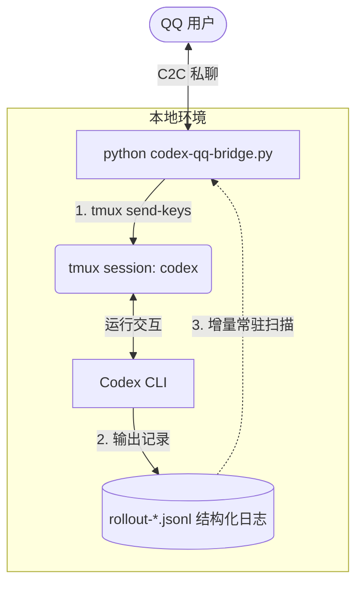

# Codex QQ Bridge 🚀

[](https://www.python.org/)
[](LICENSE)
[](https://bot.q.qq.com/)

**Codex QQ 桥接网关** — 通过 QQ 官方 WebSocket 网关直连 [Codex CLI](https://github.com/openai/codex)，支持多轮对话、会话续接。

---

## 🌟 核心架构与优势



*   **输入输出完全解耦**：QQ 消息只管送入 tmux，后台协程只管监听日志并广播回传。无忙碌锁、无同步超时死锁。
*   **支持长时间任务**：Codex 执行长任务时分步骤汇报进度时，所有输出自动捕获回传 QQ，不丢失。
*   **自适应会话切换**：执行 `/new` 重置后，监听器自动绑定新生成的 JSONL 文件，杜绝历史消息重复刷屏。
*   **无审批按钮**：Codex 使用 `--ask-for-approval on-request` 模式自行判断是否需用户确认，桥接层不做审批拦截。

---

## 🛠️ 安装与运行

### 1. 准备环境

项目运行依赖 Python 3.10+ 和本地安装的 `tmux`：

```bash
# 安装 Python 依赖
pip install -r requirements.txt

# 确保 tmux 已安装
tmux -V
```

### 2. 配置 QQ 机器人凭证

1. 在 [QQ 开放平台](https://bot.q.qq.com) 创建机器人应用，获取 `APP_ID` 和 `CLIENT_SECRET`
2. 获取你的个人 QQ OpenID（首次运行桥接器时会自动绑定到 `.env`，或通过 QQ 官方调试工具获取）
3. 复制配置模板并填入参数：

```bash
cp .env.example .env
# 编辑 .env，填入 APP_ID、CLIENT_SECRET、MASTER_OPENID
```

### 3. 安装 Codex CLI

本桥接器需要 [Codex CLI](https://github.com/openai/codex) 已安装并可在终端直接调用：

```bash
# 确认 codex 命令可用
codex --version
```

### 4. 启动桥接器

```bash
python3 codex-qq-bridge.py
```

桥接器会自动：
- 创建名为 `codex` 的 tmux 会话（可在 `.env` 中修改 `TMUX_SESSION`）
- 在该会话中启动 Codex CLI
- 连接 QQ WebSocket 网关等待消息

---

## ⚙️ 配置说明

| 变量 | 必填 | 默认值 | 说明 |
|------|------|--------|------|
| `APP_ID` | ✅ | — | QQ 开放平台应用 ID |
| `CLIENT_SECRET` | ✅ | — | QQ 开放平台应用密钥 |
| `MASTER_OPENID` | ❌ | 自动绑定 | 管理员 QQ OpenID，留空时第一个发消息的用户自动成为管理员 |
| `TMUX_SESSION` | ❌ | `codex` | tmux 会话名称，用于常驻运行 Codex |
| `CODEX_HOME` | ❌ | `~/.codex` | Codex 数据目录（含 `sessions/`） |

---

## 💬 命令列表

在 QQ 私聊中发送以下命令控制桥接器：

| 命令 | 功能 |
|------|------|
| `/new` / `/reset` / `/qingkong` | 重启 Codex，开始新会话 |
| `/stop` / `/kill` | 停止 Codex（Ctrl+C） |
| 普通文本 | 直接发送给 Codex 处理 |

---

## 🗂️ 项目结构

```
codex-qq-bridge/
├── codex-qq-bridge.py   # 主桥接脚本
├── .env.example         # 环境变量配置模板
├── .env                 # 实际配置（已加入 .gitignore，不提交）
├── .gitignore           # Git 忽略规则
├── LICENSE              # MIT 许可证
├── requirements.txt     # Python 依赖清单
├── README.md            # 本文件
├── docs/                # 技术文档
├── evidence/            # 运行截图/证据
└── logs/                # 运行时日志（已加入 .gitignore）
```

---

## 📄 许可证

本项目基于 [MIT License](LICENSE) 开源。

---

## 🔗 相关项目

- [claude-code-qq-bridge](https://github.com/zz327455573/claude-code-qq-bridge) — Claude Code QQ 桥接网关
- [AGY-QQ-Bridge](https://github.com/zz327455573/AGY-QQ-Bridge) — Google AGY QQ 桥接网关
